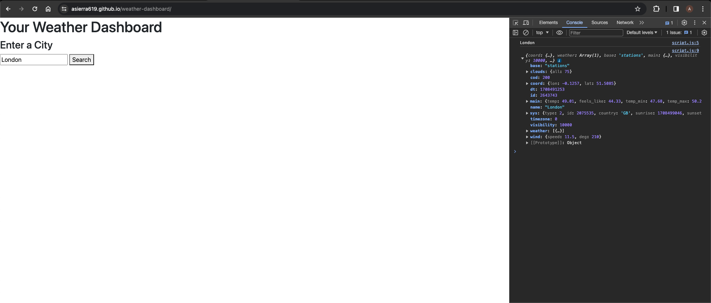

# Weather Dashboard

## Description

### THIS PROJECT IS UNFINISHED

The Weather Dashboard allows one to enter a city name and be presented with the current weather forecast, as well as the predictions for the upcoming 5 days.

## Table of Contents

- [User Story](#user-story)
- [Acceptance Criteria](#acceptance-criteria)
- [Usage](#usage)
- [Technologies Used](#technologies-used)
- [License](#license)
- [Credits](#credits)

## User Story

AS A traveler 
I WANT to see the weather outlook for multiple cities 
SO THAT I can plan a trip accordingly

## Acceptance Criteria

Acceptance Criteria-
GIVEN a weather dashboard with form inputs 
WHEN I search for a city 
THEN I am presented with current and future conditions for that city and that city is added to the search history 
WHEN I view current weather conditions for that city 
THEN I am presented with the city name, the date, an icon representation of weather conditions, the temperature, the humidity, and the the wind speed 
WHEN I view future weather conditions for that city 
THEN I am presented with a 5-day forecast that displays the date, an icon representation of weather conditions, the temperature, the wind speed, and the humidity 
WHEN I click on a city in the search history 
THEN I am again presented with current and future conditions for that city

## Usage

Live Url - https://asierra619.github.io/weather-dashboard/ 

GitHub Repo - https://github.com/asierra619/weather-dashboard 

## Technologies Used

HTML, JS, CSS, Bootstrap

## License

MIT

## Credits

Thank You to the Following - 
Sam Pai - Calendly Tutor